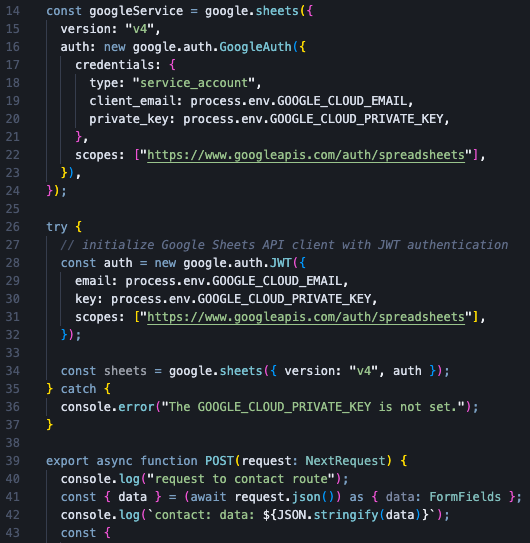
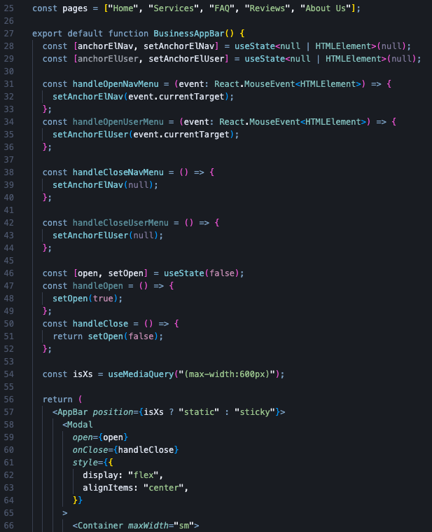
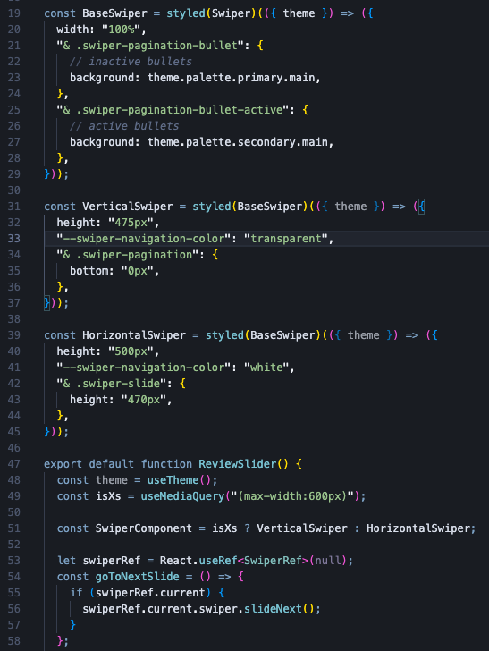

www.homeshinesolutions.com was built with: [React](https://reactjs.org/), [TypeScript](https://www.typescriptlang.org/), [Next.js](https://nextjs.org/), and [MUI](https://mui.com/). It was deployed with [Vercel](https://vercel.com/), and makes use of [Google Cloud API](https://cloud.google.com/apis), [SparkPost API](https://www.sparkpost.com/), and [Swiper](https://swiperjs.com) image carousel. It was made in collaboration with the founder of HomeShine Solutions, LLC. In building this website, I also provided graphic design and copywriting services for the logo and text.

- Google Cloud API was used for storing the contact form submission data in a Google Sheet
- SparkPost API was used to send a copy of the contact form responses to the user and to the owner of the company
   
   

    

---

### To improve the user experience, some planned future site updates include:

- migrate from Next.js to [Astro](https://astro.build/) to improve overall site performance
- improve user accessbility across the site
- improve mobile experience of modal contact form
- add before/after image gallery
- clear submission form a few seconds after submitting
- align formatting between Privacy and Terms pages
- (full list is available in the [TODO.txt](https://github.com/amalyam/homeshine-solutions/blob/main/src/TODO.txt))

---

### Code Snippets

### #1

### #2

### #3

